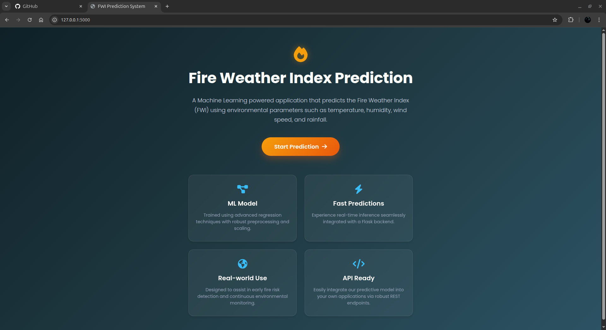
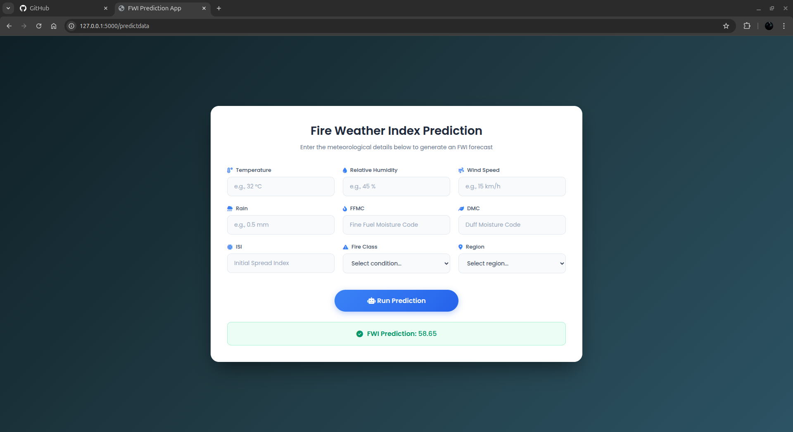

# 🔥 Forest Fire Prediction – Flask ML Deployment

A Machine Learning web application that predicts forest fire risk using a trained **Ridge Regression** model deployed with Flask.

The model takes environmental parameters such as Temperature, Humidity, Wind Speed, Rain, FFMC, DMC, ISI, Classes, and Region to estimate fire risk.

---

## 🚀 Demo

**Web Interface:**  
http://localhost:5000/

**API Endpoint:**  
`POST /api/predict`

---

## 📌 Features

- Ridge Regression trained model  
- StandardScaler preprocessing pipeline  
- Web-based form input  
- REST API endpoint for external integration  
- Error handling  
- Model served using Flask  

---

## 🛠 Tech Stack

- Python  
- Flask  
- Scikit-learn  
- NumPy  
- HTML  
- Pickle  

---

## 🧠 Machine Learning Details

- **Algorithm:** Ridge Regression  
- **Preprocessing:** StandardScaler  
- **Model Persistence:** Pickle  
- **Deployment Framework:** Flask  

---

## 📂 Project Structure

```bash
forest-fire-ml/
│
├── models/
│   ├── ridge.pkl
│   └── scaler.pkl
│
├── templates/
│   ├── index.html
│   └── home.html
│
├── app.py
├── requirements.txt
└── README.md
```

---

## ⚙️ Installation & Setup

### 1️⃣ Clone the Repository

```bash
git clone https://github.com/yourusername/forest-fire-ml.git
cd forest-fire-ml
```

### 2️⃣ Create Virtual Environment

```bash
python -m venv venv
```

Activate environment:

**Linux / Mac**
```bash
source venv/bin/activate
```

**Windows**
```bash
venv\Scripts\activate
```

### 3️⃣ Install Dependencies

```bash
pip install -r requirements.txt
```

### 4️⃣ Run the Application

```bash
python app.py
```

Server will run at:

```
http://localhost:5000
```

---

## 🧪 API Usage Example

### Endpoint

```
POST /api/predict
```

### Sample Request (JSON)

```json
{
  "Temperature": 30,
  "RH": 40,
  "Ws": 10,
  "Rain": 0,
  "FFMC": 85,
  "DMC": 26,
  "ISI": 5,
  "Classes": 1,
  "Region": 2
}
```

### Sample Response

```json
{
  "prediction": 0.87
}
```

### Example using curl

```bash
curl -X POST http://localhost:5000/api/predict \
-H "Content-Type: application/json" \
-d '{"Temperature":30,"RH":40,"Ws":10,"Rain":0,"FFMC":85,"DMC":26,"ISI":5,"Classes":1,"Region":2}'
```

---

## ⚙️ How It Works

1. User submits environmental parameters through the web form or API.
2. Input data is scaled using the saved `StandardScaler`.
3. The Ridge Regression model predicts fire risk.
4. The result is returned as:
   - Rendered HTML (web interface)
   - JSON response (API endpoint)

---

## 📷 Screenshots

### Input Form


### Prediction Output


---

## 📈 Future Improvements

- Add Docker support  
- Deploy on cloud (Render / AWS / Railway)  
- Add input validation layer  
- Improve frontend UI  
- Add model monitoring  
- Add training notebook  

---

